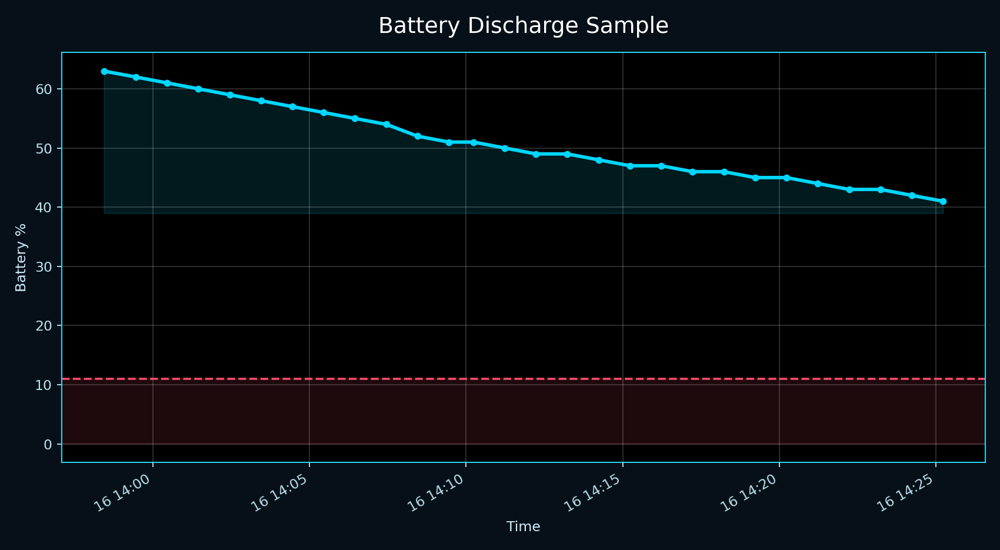
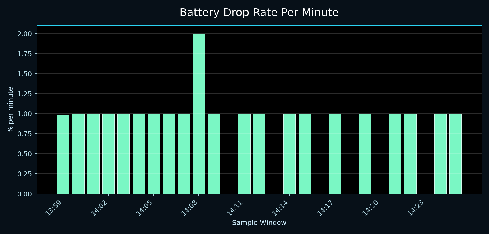

# BatteryPowerd

Small laptop battery hibernate helper built around a shell script plus a user `systemd` timer.

## Overview

BatteryPowerd checks the current battery percentage and charging state, then triggers hibernation when the battery is critically low and still discharging.

The public repo keeps the live setup small:

- `battery_hibernate.sh` is the real low-battery hibernate check
- `systemd-user/` contains the user service and timer
- `battery_status.sh` is a terminal helper for watching battery state
- `plot_battery.py` graphs recorded discharge data so the timer interval can be tuned
- `install.sh` installs the scripts and user units into standard per-user paths
- `legacy/` contains older support material

## Requirements

- `bash`
- `systemd --user`
- `upower` for the status helper
- a battery exposed at `/sys/class/power_supply/BAT0/` by default

## Quick Start

```bash
chmod +x battery_hibernate.sh battery_status.sh install.sh
./install.sh
systemctl --user enable --now battery-hibernate.timer
```

Check the timer:

```bash
systemctl --user status battery-hibernate.timer
systemctl --user list-timers | grep battery-hibernate
```

## How It Works

`battery_hibernate.sh` reads:

- battery percentage from `/sys/class/power_supply/BAT0/capacity`
- battery state from `/sys/class/power_supply/BAT0/status`

If the battery is discharging and the percentage is within the configured low range, it runs:

```bash
systemctl hibernate -i
```

By default the trigger range is `0` to `11` percent.

The timer cadence matters. If the timer runs too slowly, the machine can miss the safe hibernate window and die before hibernation completes. If it runs too often, hibernation may trigger earlier than necessary. The discharge graphing workflow is there to help tune that interval against the actual battery drain rate on the machine.

## Discharge Graph Workflow

The practical workflow is:

1. log battery percentage over time during normal discharge
2. graph the recorded data
3. estimate how quickly the battery falls near the critical range
4. choose a timer interval that is fast enough to avoid late hibernation but not so fast that it fires too early

The graph helper is:

```bash
python3 plot_battery.py battery_data.csv
```

An example dataset is included:

```bash
python3 plot_battery.py battery_data_sample.csv
```

Sample visuals generated from the included dataset:





If you keep a shell alias for it:

```bash
alias batgraph="python3 $HOME/.local/share/batterypowerd/plot_battery.py $HOME/.local/share/batterypowerd/battery_data.csv"
```

That alias is optional. The point is to make interval tuning a measured decision rather than a guess.

## Configuration

You can override the default paths and thresholds with environment variables:

```bash
BATTERYPOWERD_BAT_PATH=/sys/class/power_supply/BAT1/capacity
BATTERYPOWERD_STATE_PATH=/sys/class/power_supply/BAT1/status
BATTERYPOWERD_THRESHOLD_LOW=0
BATTERYPOWERD_THRESHOLD_HIGH=11
BATTERYPOWERD_HIBERNATE_COMMAND="systemctl hibernate -i"
BATTERYPOWERD_UPOWER_DEVICE=/org/freedesktop/UPower/devices/battery_BAT0
BATTERYPOWERD_STATUS_INTERVAL=5
```

If you need custom environment variables in the timer path, add them to the user service unit after install.

If the battery is dropping quickly near the cutoff point, shorten the timer interval in `battery-hibernate.timer`. If the machine has a wide safe margin, you can keep the timer more relaxed.

## Manual Install

If you do not want to use `install.sh`, copy the files manually:

```bash
mkdir -p "$HOME/.local/bin" "$HOME/.config/systemd/user" "$HOME/.local/share/batterypowerd"
cp battery_hibernate.sh "$HOME/.local/bin/battery_hibernate.sh"
cp battery_status.sh "$HOME/.local/bin/battery_status.sh"
cp plot_battery.py "$HOME/.local/share/batterypowerd/plot_battery.py"
cp systemd-user/battery-hibernate.service "$HOME/.config/systemd/user/"
cp systemd-user/battery-hibernate.timer "$HOME/.config/systemd/user/"
chmod +x "$HOME/.local/bin/battery_hibernate.sh" "$HOME/.local/bin/battery_status.sh"
systemctl --user daemon-reload
systemctl --user enable --now battery-hibernate.timer
```

## Shell Helper

You can keep a quick battery watcher in your shell:

```bash
alias bd="$HOME/.local/bin/battery_status.sh"
```

And optionally a graph alias:

```bash
alias batgraph="python3 $HOME/.local/share/batterypowerd/plot_battery.py $HOME/.local/share/batterypowerd/battery_data.csv"
```

## Repository Scope

This repo is intentionally narrow:

- current working hibernate checker
- timer/service used to run it
- small terminal helper
- graph helper for timer tuning
- sample discharge dataset for graph testing
- sample graph images for visual interval tuning

It is not trying to be a full power-management daemon.

## License

GNU GPL v2
